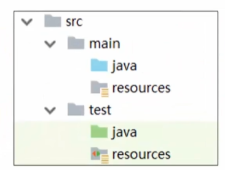
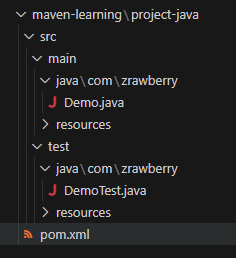

# Maven 学习

资源：黑马程序员 [B 站](https://www.bilibili.com/video/BV1Ah411S7ZE)


当前学习进度：[Link](https://www.bilibili.com/video/BV1Ah411S7ZE)


Maven 本质：项目管理工具，将开发和管理抽象层项目对象模型（POM, Project Object Model）。


图中间为 Maven 核心，虚线上是对项目的操作，虚线下是Maven支持的能力。

作用：项目管理（标准、跨平台）、依赖管理（管理jar包）、统一开发结构。




## 仓库、坐标

仓库：中央、私服、本地

**坐标**：用于查找资源位置repo1.maven.org/maven2/

坐标组成：groupId 隶属的组织、artifactId, 项目名称、version 版本号。

[Maven Repository: Search/Browse/Explore (mvnrepository.com)](https://mvnrepository.com/)

**配置位置**

执行 `mvn` 后会多一个.m2目录存放，：修改 maven 目录下 conf/settings.xml 中的 localRepository


## Maven 项目的构建



Maven 项目构建命令

- `mvn compile`  编译
- `mvn clean` 清理
- `mvn test` 测试
- `mvn package` 打包
- `mvn install` 安装到本地仓库


使用插件创建工程

```
mvn archetype:generate
	-DgroupId={project-packaging}
	-DartifactId={project-name}
	-DarchetypeArifactId=maven-archetype-quickstart
	-DinteractiveMode=False
```

Java 工程

```
mvn archetype:generate -DgroupId=com.zrawberry -DartifactId=project-java-auto-generated -DarchetypeArtifactId=maven-archetype-quickstart -Dversion=0.0.1 -DinteractiveMode=false
```

Web 工程

```
mvn archetype:generate -DgroupId=com.zrawberry -DartifactId=project-java-web-auto-generated -DarchetypeArtifactId=maven-archetype-webapp -Dversion=0.0.1 -DinteractiveMode=false
```

会生成一个 web app 目录


其他

1. 在 idea 中通过 maven 构建项目
2. 下载 maven 的tomcat 插件，通过插件启动服务。

