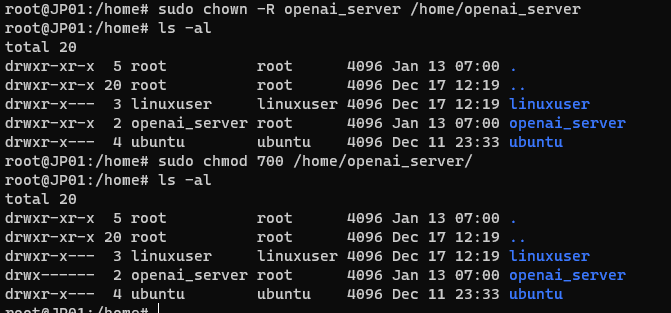

# Linux 常用命令


## 1 文件系统

`stat -c %s` 文件名命令来获取文件的大小

`ls -lt` 列出文件的同时 按时间排序


## 2 用户管理

### 2.1 新用户

添加新的用户`sudo useradd <用户名>`

修改用户的密码 `sudo passwd <用户名>`

为新创建的用户设置home目录的权限：`sudo chown -R <用户名>:<组名> /home/<用户名>`

设置home目录的访问权限，通常是设置为700（即只有所有者具有读、写和执行权限），使用以下命令：`sudo chmod 700 /home/<用户名>`



新用户默认会使用 `/bin/sh`，修改为 bash 可以参考如下步骤：

1. 使用root用户或具有sudo权限的用户登录到系统。

2. 打开终端窗口，执行以下命令以编辑用户账户的登录Shell：
   ```
   sudo chsh -s /bin/bash <用户名>
   ```
   将`<用户名>`替换为要修改的用户的实际用户名。

3. 输入您的密码（在执行sudo命令时需要）并按下Enter键。

4. 系统会提示您输入新的登录Shell。输入 `/bin/bash` 并按下Enter键。

5. 完成后，终端将显示一条消息，确认成功更改了用户的登录Shell。

6. 用户现在应该能够使用`/bin/bash`作为默认Shell登录到系统了。

请注意，更改用户的默认Shell可能会影响其环境变量和配置文件。确保在更改之前备份或迁移用户相关的配置信息。操作后查看用户可以发现为`openai_server:x:1002:1002::/home/openai_server:/bin/bash`


查看**当前**有哪些用户：

- `who`：查看当前登录系统的用户
- `w`：查看当前登录系统的用户，它会显示更详细的信息，包括用户的登录时间、运行的进程等：
- `users`：列出当前已登录系统的用户名列表
- `last`：以显示最近登录系统的用户和登录时间

查看有哪些用户：`cat /etc/passwd`


## 防火墙设置


运行 icmp 协议 ping

`sudo vim /etc/ufw/before.rules`

